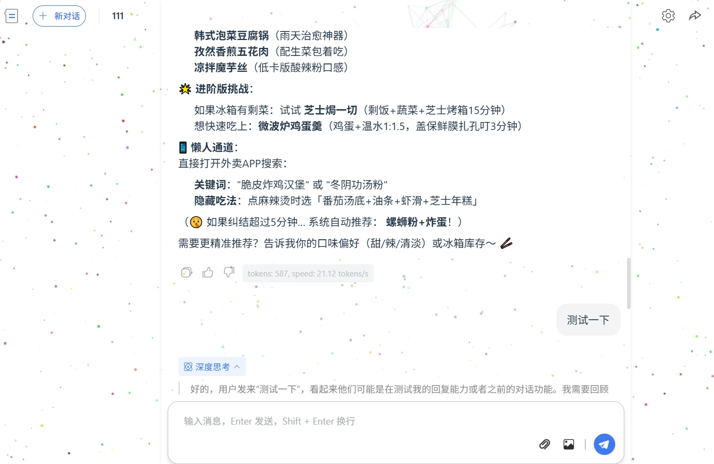
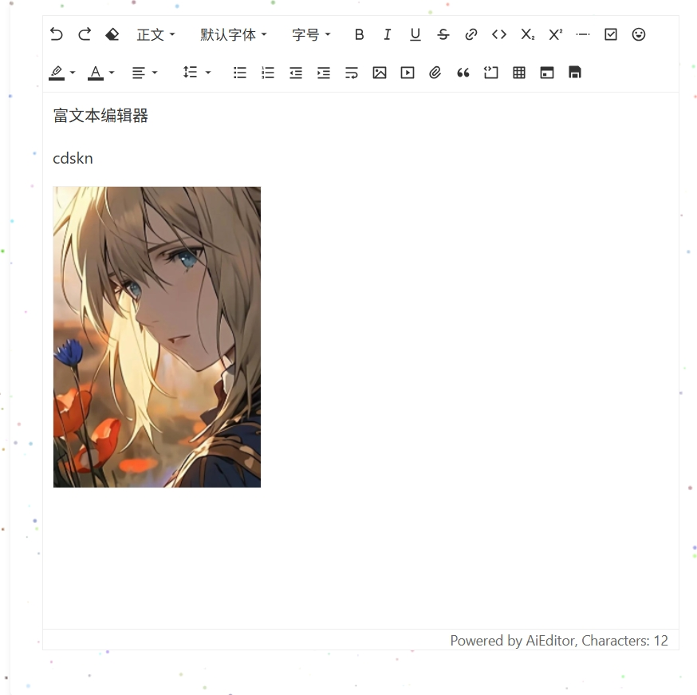

# Note-Me 📌  

🚀 开发中，感兴趣的朋友欢可以点个star - 这是对我最好的支持！

**轻量级笔记管理工具** | 高效整理你的碎片化知识  


## 🚀 项目简介  
Note-Me 是一款简洁易用的跨平台笔记管理系统，旨在帮助用户快速记录、分类和检索日常笔记、灵感及资料。支持富文本编辑、标签分类、云同步等核心功能，适用于学生、开发者、办公人群等多场景。  


## 🌟 核心功能  
- ✏️ **富文本编辑**：支持标题、列表、代码块、图片插入等格式  
- 🏷️ **智能标签系统**：灵活分类与快速检索笔记  
- 🌐 **多端同步**：支持Windows/macOS/Linux/Web多平台数据同步  
- 🗄️ **离线存储**：本地数据加密存储，保障隐私安全  
- 📊 **统计分析**：笔记数量、活跃趋势等可视化数据  


## 🖥️ 项目演示  
### 界面预览  
| 主界面概览                  | 文件归档                |  
|-----------------------------|-----------------------------|  
|  |  |  

| deekseep对话                | 简单记录                |  
|-----------------------------|-----------------------------|  
|  |  |  

| 文本编辑                | 
|-----------------------------|-----------------------------|  



## 📦 快速开始  
### 安装方式  
1. **Windows/macOS**：  
   下载最新安装包：[Releases](https://github.com/your-username/note-me/releases)  
2. **Web端**：  
   访问在线演示：[https://note-me.example.com](https://note-me.example.com)  
3. **开发者模式**：  
   ```bash  
   git clone https://github.com/your-username/note-me.git  
   cd note-me  
   npm install && npm run dev  
